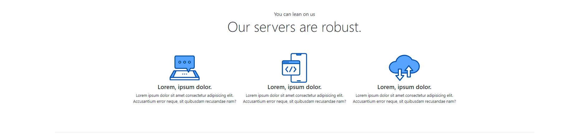

# Hosting Landing Page
## Bootstrap v5.1.3

A reproduire le site "Hosting Landing Page"  
N'utilisez que les classes Bootstrap
Les documents sont disponible sur Form-e

Header
&nbsp;&nbsp;  

Section "Servers"  
&nbsp;&nbsp;  

Section "Quality or nothing"
&nbsp;&nbsp;  

Section "It's now or never"
&nbsp;&nbsp;  

Section "Projects"  
&nbsp;&nbsp;  
