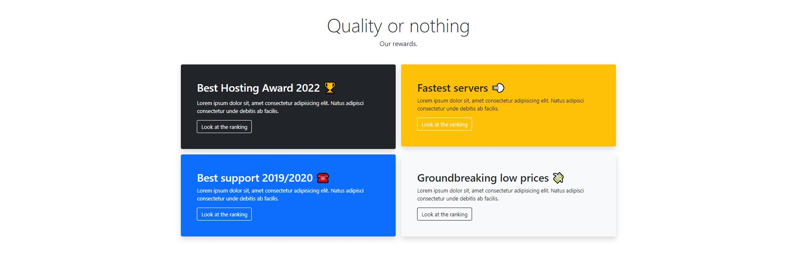
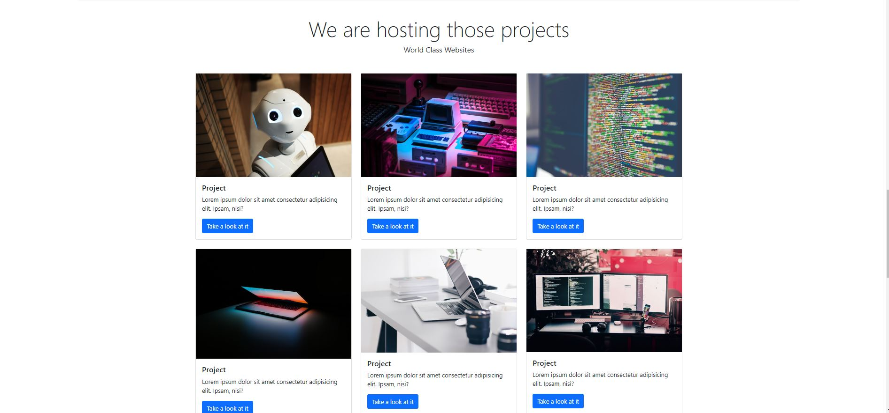

# Hosting Landing Page
## Bootstrap v5.1.3

A reproduire le site "Hosting Landing Page"  
N'utilisez que les classes Bootstrap  
Les documents sont disponible sur Form-e  

  

Header
&nbsp;&nbsp;  

Section "Servers"  
&nbsp;&nbsp;  

Section "Quality or nothing"
&nbsp;&nbsp;  

Section "It's now or never"  
&nbsp;&nbsp;  

Section "Projects"  
&nbsp;&nbsp;  

Section "Pricing" & "Take action"  
Deux sections différentes
&nbsp;&nbsp;  

Section "Contact-us"
&nbsp;&nbsp;  

## DeadLine le 12 avril 2023
